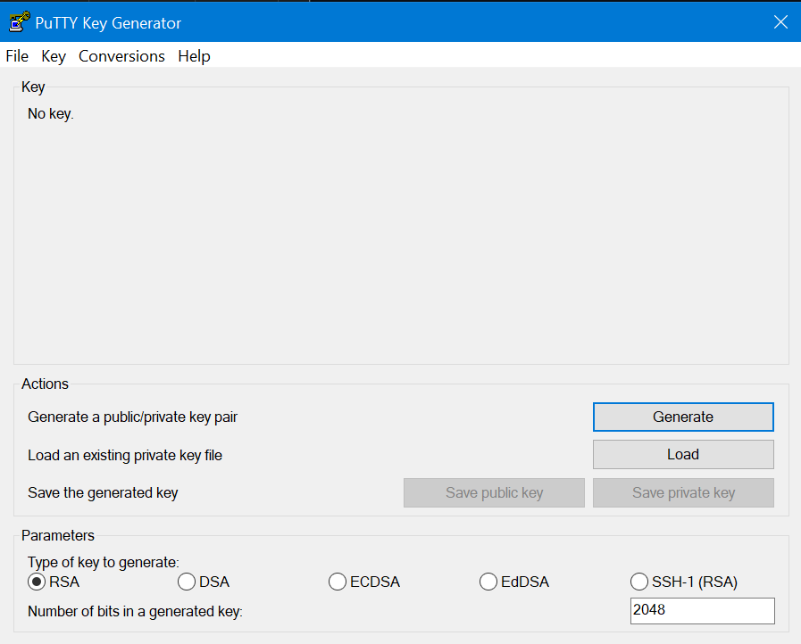

# SSDNodes Host Setup and SSH Access Guide (Windows Edition)

> Companion document for **TAK-VPS-LXD-DEPLOYMENT-GUIDE.md**. This guide walks through setting up a fresh SSDNodes VPS for SSH access using **PuTTY** and **WinSCP** from Windows. It also includes notes for macOS/Linux users and placeholders for images.

---

## Scope and purpose

This document covers:

- Preparing a new SSDNodes VPS for secure SSH access
- Creating SSH key pairs with PuTTYGen
- Adding the public key to SSDNodes control panel
- Connecting via PuTTY and WinSCP using the private key

> ⚠️ **Note:** This setup assumes you are using passwordless SSH with key-based authentication. Once a public key is added during SSDNodes provisioning, **root password login is disabled.**

---

## 1. Generate SSH keys using PuTTYGen

**Tool:** PuTTY Key Generator (PuTTYGen)

1. Launch PuTTYGen.  
2. Under **Parameters**, keep defaults: RSA, 2048 bits (or increase to 4096 if desired).
   
3. Click **Generate**, and move the mouse randomly in the blank area to generate entropy.
   
   
   
4. Once complete, note the fields:
   - **Public key** (for pasting into SSDNodes)
   - **Key fingerprint**
   - **Key comment**


5. *(Optional)* Enter a **Key passphrase** for additional security.  
6. Click **Save public key** and **Save private key**, naming them with your convention, e.g.:
   - `tak-domain-tld_pub`  
   - `tak-domain-tld_pvt.ppk`
7. Copy the entire text from the **Public key for pasting into OpenSSH authorized_keys file** field.

> ⚠️ **Important:** Remove the comment at the end before pasting into SSDNodes panel if it contains unsupported characters. SSDNodes only allows alphanumeric, `/`, `+`, `@`, `_`, `=`.

---

## 2. Add public key to SSDNodes control panel

1. Log into your **SSDNodes Dashboard**.  
2. Select **Manage** → **Install/Reinstall** for your VPS.  
3. In the **SSH key** field, paste your **public key** (from PuTTYGen).  
4. Remove any trailing comment if it triggers this error:  
   > “SSH Comment format is invalid. Only enter Alphanumeric, Slash (/), Plus (+), At sign (@), Underscore (_) or Equal sign (=) in comment.”
5. Confirm and launch installation.


> Once an SSH key is set, root SSH password access will be disabled.

---

## 3. Connect using PuTTY (Windows)

1. Open **PuTTY**.  
2. In **Host Name (or IP address)**, enter your VPS public IP.  
3. Verify **Port = 22**, **Connection type = SSH**.  
4. In the left sidebar, go to **Connection → SSH → Auth → Credentials**.  
5. Under **Private key file for authentication**, browse and select your `.ppk` private key.  
6. Return to **Session**, enter a session name under **Saved Sessions**, and click **Save**.  
7. Click **Open** to connect.


8. The first time, you’ll see a **host key not cached** warning — click **Accept**.  
9. When prompted, log in as `root` (first connection only; you’ll add a new admin user later).

---

## 4. Connect using WinSCP (Windows)

1. Open **WinSCP**.  
2. In the **Login** window:
   - **File protocol:** SFTP
   - **Host name:** VPS public IP
   - **Port number:** 22
   - **User name:** leave blank for now
   - **Password:** leave blank
3. Click **Advanced** → **SSH → Authentication**.  
4. Under **Private key file**, browse and select your `.ppk` file.  
5. Click **OK**, then **Login**.  
6. Accept the host key warning.  
7. When prompted, log in as `root`.  


---

## 5. Verify access and prepare for host setup

Once logged in via PuTTY or WinSCP:

- Run updates:
  ```bash
  apt update && apt upgrade -y
  ```
- Create a non-root admin user (as shown in the main deployment guide).
- Copy your SSH public key to that user’s `~/.ssh/authorized_keys` file.

You are now ready to continue with **TAK-VPS-LXD-DEPLOYMENT-GUIDE.md**, starting from *Section 5.1 Host provisioning & hardening*.

---

## 6. Notes for Linux / macOS users

For users not on Windows:

```bash
# Generate SSH keypair
ssh-keygen -t rsa -b 4096 -C "tak@example.tld"
# Copy public key to clipboard
cat ~/.ssh/id_rsa.pub
# Paste this into SSDNodes dashboard during VPS setup
```

To connect after provisioning:

```bash
ssh root@<your_vps_ip> -i ~/.ssh/id_rsa
```

---

## 7. Troubleshooting

| Symptom | Cause | Fix |
|----------|--------|-----|
| “Server refused our key” | Public key copied incorrectly or includes invalid characters | Regenerate or re-copy public key, remove comment, reinstall VPS |
| “Permission denied (publickey)” | Key mismatch or wrong private key selected | Check `.ppk` path in PuTTY/WinSCP |
| Connection refused | Firewall or reinstall in progress | Wait for SSDNodes install to complete; verify ports |

---

## 8. Next steps

Proceed to:

➡️ **TAK-VPS-LXD-DEPLOYMENT-GUIDE.md** → Section 5.1 Host provisioning & hardening.

---

*End of SSDNodes-Host-Setup-and-SSH.md*

